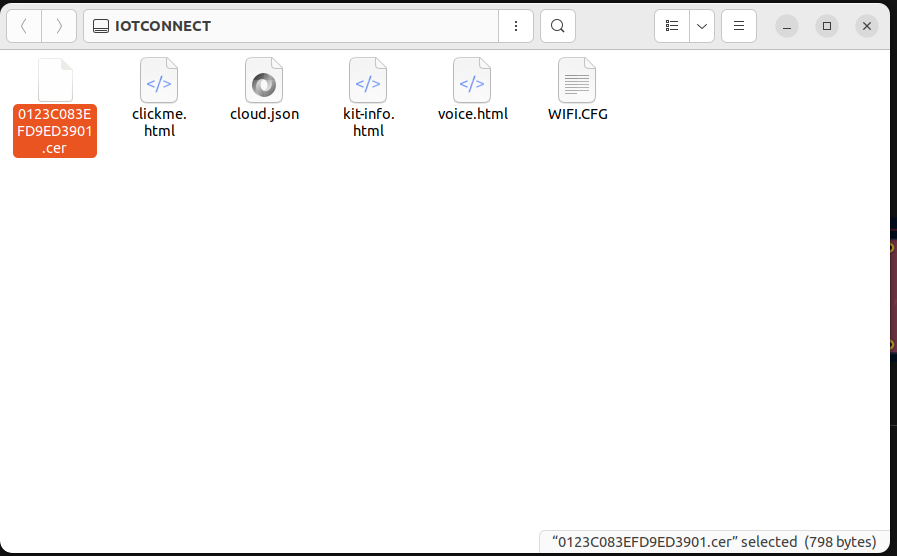
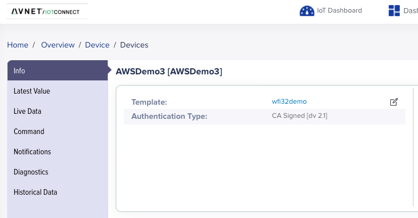

# Microchip WFI32-IoT Development Board Connection to Avnet IoTConnect Platform

## Introduction
This demo project showcases the integration of the [WFI32-IoT Development Board](https://www.microchip.com/en-us/development-tool/ev36w50a) with the [Avnet IoTConnect Platform](http://awspoc.iotconnect.io/), utilizing [FreeRTOS](https://www.microchip.com/en-us/tools-resources/evaluation-boards/third-party/freertos) for efficient multitasking. It leverages Avnet [IoTC library](https://github.com/avnet-iotconnect/iotc-c-lib) (see Notes section forr details) and features regular or on demand transmission of built-in sensor readings to the platform and enables the execution of remote commands from the platform to control the board's LEDs, providing examples of data communication and interactive management for IoT applications.

## Features
- Secure WPA2 Wi-Fi connection setup with the Microchip WFI32-IoT Board.
- WolfSSL Transport Layer Security stack.
- IoTConnect platform connection with an X509 device certificate.
- Levereging [ATECC608B](https://www.microchip.com/en-us/product/ATECC608B) on-board secure element for cloud authentication (Trust&GO).
- Data transmission from the board to the Avnet IoTConnect Platform using MQTT.
- Once-per-minute light and tempreature sensor data reporting.
- Board LEDS and board switches state reporting.
- Board LEDs control from IoTConnect dashboard.

## Prerequisites

Before you begin, ensure you have the following:

- Microchip WFI32-IoT Development Board.
- Access to the Avnet IoTConnect Platform.
- Microchip [MPLAB X IDE 6.20](https://www.microchip.com/en-us/tools-resources/develop/mplab-x-ide) installed on your computer.
- [XC32 v4.35 compiler](https://ww1.microchip.com/downloads/aemDocuments/documents/DEV/ProductDocuments/ReleaseNotes/README.html) from Microchip.

## Getting Started

Follow these steps to get your Microchip WFI32-IoT Board connected to the Avnet IoTConnect Platform:

### 1. Project Configuration
- Clone the [project repository](https://gitlab.indeema.com/indeema-iotc/iotc-microchip-wfi32-demo/) along with its submodules using git clone --recursive command.
- In MPLAB IDE, open the project from the cloned folder.
- In the MPLAB Harmony, upload [this manifest file](https://gitlab.indeema.com/indeema-iotc/iotc-microchip-wfi32-demo/-/blob/main/firmware/src/config/default/harmony-manifest-success.yml) to install dependencies.
- Connect your Microchip WFI32-IoT Board to your computer with a USB cable.
- Flash drive with device certificate and Wi-Fi configuration file on it should appear in the system 

- Copy the certificate and attach it to the device in the IoTConnect account.
- Provide proper Wi-Fi credentials in the WIFI.CFG file by replacing the line in it as follows  CMD:SEND_UART=wifi ssid,password,2
where ssid and passord are valid credentials.
- Provide Endpoint URL and IoTConnect Device ID (Client ID) in the cloud.json file. 

### 2.IoTConnect counterpart

- Example uses the IoTConnect device based on the wfi32demo template, supporting 10 attributes and 4 different commands. The device template json file is included in the repo.  

- IoTConnect Dashboard for viewing sensor data is available through [this link](https://awspoc.iotconnect.io/view-dashboard/C83CEF35-FC67-4578-8383-4916C9E3E4E5).

### 3. Compilation and Deployment

Build and run the project using Run command form IDE.

### 4. Testing the functionality

Monitor the board's output in serial terminal to confirm a successful connection to the Wi-Fi network and the Avnet IoTConnect Platform and other logs from the board.
Watch Avnet IoTConnect dashboard to see the incoming data from your board. Send command from the platform to see LED changes on the dashboard.

## Troubleshooting

If you encounter any issues, please refer to the WFI32-IoT Board documentation and the [Avnet IoTConnect Platform documentation] (https://docs.iotconnect.io/iotconnect/). For further assistance, consider opening an issue in this repository.

## Acknowledgments
Thanks to Avnet for the IoTConnect Platform and continious support.

## Notes
Current version of the project uses this branch which is ahead opf master branch: 
https://github.com/avnet-iotconnect/iotc-c-lib/tree/protocol-v2.1

