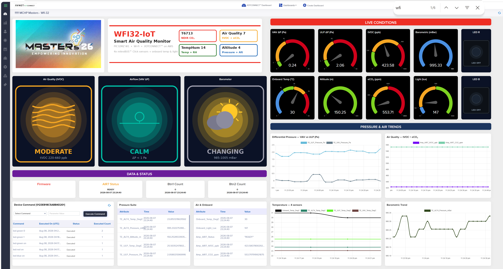

# Microchip WFI32-IoT Board /IOTCONNECT Demo (FreeRTOS + wolfSSL)

This demo connects the [Microchip WFI32-IoT Development Board](https://www.microchip.com/en-us/development-tool/ev36w50a)
to the [Avnet /IOTCONNECT platform](https://www.iotconnect.io/) on AWS. It uses FreeRTOS, the wolfSSL TLS stack,
and the on-board ATECC608B Trust&GO secure element for cloud authentication, and it reports data from the on-board
sensors plus a range of MikroElektronika Click boards that are auto-detected at boot.

* On-board light and temperature sensor telemetry
* Auto-detection and telemetry for nine I2C Click boards (see [Supported Click Boards](#3-supported-click-boards))
* Runtime /IOTCONNECT HTTP discovery — no hardcoded broker endpoint
* Device commands from the cloud (LEDs, counter reset)
* X.509 mutual-TLS using the pre-provisioned ATECC608B (no key material on the host or in flash)



## Index

1. [Prerequisites](#1-prerequisites)
2. [Hardware Setup](#2-hardware-setup)
3. [Supported Click Boards](#3-supported-click-boards)
4. [/IOTCONNECT Template and Device Setup](#4-iotconnect-template-and-device-setup)
5. [Board Configuration](#5-board-configuration)
6. [Build and Flash](#6-build-and-flash)
7. [Verification](#7-verification)
8. [Dashboards](#8-dashboards)
9. [Troubleshooting](#9-troubleshooting)
10. [Acknowledgments](#acknowledgments)

## 1. Prerequisites

* Microchip WFI32-IoT Development Board (EV36W50A)
* USB Micro-B cable
* 2.4 GHz Wi-Fi network (the WFI32E01 module is 2.4 GHz only)
* An [/IOTCONNECT account](https://www.iotconnect.io/) (AWS-backed)
* [MPLAB X IDE](https://www.microchip.com/en-us/tools-resources/develop/mplab-x-ide) v6.25 (or later) with the
  **XC32 v4.60** compiler and **PIC32MZ-W_DFP v1.10.334** device pack — see the
  [Developer Guide](DEVELOPER_GUIDE.md) for details and command-line builds
* Optional: one or more supported Click boards, individually or on a mikroBUS Shuttle

## 2. Hardware Setup

1. Plug Click board(s) into the mikroBUS socket (J402), matching the notch to the silkscreen.
2. Connect the board to your PC with the Micro-B USB cable. Two serial ports and a USB drive
   (`WFI32-IOT`, later `IOTCONNECT`) will enumerate.

> **⚠ Power budget — read this before stacking multiple Click boards.**
> The board's Debug USB port is limited to **500 mA total** (see the
> [board user guide](https://ww1.microchip.com/downloads/aemDocuments/documents/WSG/ProductDocuments/UserGuides/EV36W50A-WFI32-IoT-Board-Users-Guide-DS50003262.pdf),
> §3.1), shared between the MCU, the radio, the debugger, and everything on the mikroBUS socket.
> Wi-Fi transmit bursts alone peak near 300 mA. With several Click boards attached (e.g. four on a
> Shuttle), the supply can sag during transmit and **Wi-Fi will associate but fail the WPA2
> handshake over and over** (the AP retries EAPOL M1 and then deauthenticates, reason 0x02).
> If you see repeated `WiFi connection failed` while Click boards are attached:
> * use a high-current USB port or powered hub,
> * and/or connect a 4.2 V Li-Po battery to J101 to supplement the budget,
> * and/or reduce the number of attached Click boards,
> * and keep the Click stack physically clear of the PCB antenna at the top of the board.

## 3. Supported Click Boards

All supported Clicks are I2C devices on the shared sensor bus and are **auto-detected at every boot** —
no rebuild or configuration is needed when you add or remove one.

| Click board | Sensor | I2C address | Telemetry attributes |
|---|---|---|---|
| [Air Quality 7](https://www.mikroe.com/air-quality-7-click) | MiCS-VZ-89TE | 0x70 | `Amp_AIR7_Status`, `Amp_AIR7_tVOC_ppb`, `Amp_AIR7_CO2_ppm` |
| [Altitude 2](https://www.mikroe.com/altitude-2-click) | MS5607 | 0x76/0x77 | `TE_ALT2_Temp_DegC`, `TE_ALT2_Pressure_mBar`, `TE_ALT2_Altitude_m` |
| [Altitude 4](https://www.mikroe.com/altitude-4-click) | NPA-201 | 0x27 | `TE_ALT4_Temp_DegC`, `TE_ALT4_Pressure_mBar`, `TE_ALT4_Altitude_m` |
| [PHT](https://www.mikroe.com/pht-click) | MS8607 | 0x40 + 0x76 | `TE_PHT_Temp_DegC`, `TE_PHT_Pressure_mBar`, `TE_PHT_Humidity_Percent` |
| T6713 CO2 (on [PROTO](https://www.mikroe.com/proto-click)) | T6713 | 0x15 | `TEL_T6713_Status`, `TEL_T6713_CO2_ppm` |
| T9602 Temp&Hum (on [Terminal 2](https://www.mikroe.com/terminal-2-click)) | T9602 | 0x28 | `TEL_T9602_Status`, `TEL_T9602_Humidity_Percent`, `TEL_T9602_Temp_DegC` |
| [Temp&Hum 14](https://www.mikroe.com/temphum-14-click) | HTU31D | 0x40 | `TE_TH14_Humidity_Percent`, `TE_TH14_Temp_DegC` |
| [Ultra-Low Press](https://www.mikroe.com/ultra-low-press-click) | SM8436 | 0x6C | `TE_ULP_Temp_DegC`, `TE_ULP_Pressure_Pa` |
| [VAV Press](https://www.mikroe.com/vav-press-click) | LMIS025B | 0x5C | `TE_VAV_Pressure_Pa`, `TE_VAV_Temp_DegC` |

Up to four can be attached at once with a mikroBUS Shuttle expansion — subject to the power budget above.

## 4. /IOTCONNECT Template and Device Setup

1. In /IOTCONNECT, go to **Device → Templates → Import** and import
   [`wfi32demo_template.JSON`](wfi32demo_template.JSON) from this repository. The template includes all
   on-board and Click attributes plus the four device commands.
2. Plug the board in and open the `WFI32-IOT` USB drive. Note the certificate file name — it embeds the
   device's unique ATECC608B serial, e.g. `sn0123E818C5ABB4D201_device.pem` → serial `0123E818C5ABB4D201`.
3. Create a device:
   * **Unique ID (DUID)** and **Display Name**: the ATECC serial **without** the `sn` prefix
     (e.g. `0123E818C5ABB4D201`)
   * **Template**: `wfi32demo`
   * **Certificate**: upload the `.pem`/`.cer` device certificate from the USB drive
     (auth type: self-signed / individual certificate)

The DUID **must** be the ATECC serial: the TLS client identity comes from the secure element and cannot
be changed in software.

## 5. Board Configuration

Edit two files on the board's USB drive:

* **`WIFI.CFG`** — one line, replacing ssid/password with your 2.4 GHz network credentials:

  ```
  CMD:SEND_UART=wifi ssid,password,2
  ```

* **`cloud.json`** — set `ClientID` to the device DUID:

  ```json
  {
  "Endpoint":"a3etk4e19usyja-ats.iot.us-east-1.amazonaws.com",
  "ClientID":"0123E818C5ABB4D201"
  }
  ```

  The MQTT broker hostname is resolved at runtime through /IOTCONNECT HTTP discovery; the `Endpoint`
  field is retained for compatibility. Discovery uses the CPID and environment compiled into
  [`firmware/src/iotc_config.h`](firmware/src/iotc_config.h) — if you are using **your own /IOTCONNECT
  account**, set `IOTC_AWS_CPID` and `IOTC_AWS_ENV` there (values are shown in /IOTCONNECT under
  *Settings → Key Vault*) and rebuild.

Safely eject / power-cycle after editing so the firmware picks up the changes.

## 6. Build and Flash

1. Clone this repository **with submodules**:

   ```
   git clone --recursive <this repo>
   ```

2. Open `firmware/iotc-wfi32-aws-demo.X` in MPLAB X IDE (v6.25+, XC32 v4.60, DFP 1.10.334).
3. Select the `aws_sdk_wfi32_iot_freertos` configuration and click **Make and Program Device**.
4. **Power-cycle the board after flashing** (unplug USB, wait 3 s, replug). After a debugger-driven
   program cycle the application frequently stays halted until a true power-on reset — this is normal
   for this board.

Command-line builds, flashing by debugger serial number, and toolchain notes are covered in the
[Developer Guide](DEVELOPER_GUIDE.md).

## 7. Verification

The board exposes **two** serial ports (115200 8N1):

| Windows device name | UART | Content |
|---|---|---|
| **USB Serial Device** | UART1 | Application console — connection status, Click detection, telemetry (use this one) |
| PICkit 4 On Board Virtual COM Port | UART3 | Wi-Fi driver debug (`MAC:` messages) and `printf` output |

On the application console you should see, in order:

```
Detecting attached Click Board sensors...
  I2C1 ack 0x18            <- on-board MCP9808 (always present)
  I2C1 ack 0x44            <- on-board OPT3001 (always present)
  I2C1 ack 0x6C            <- your Click(s)
...
Ultra Low Press Click Detected!
[APP] WiFi Connected
[APP] Received IP Address: = ...
[IOTC] discovery response ...
[IOTC] MQTT connected
[IOTC] published -> $aws/rules/msg_d2c_rpt/<DUID>/2.1/0 : {"d":[{"d":{...}}]}
```

The boot-time I2C scan doubles as a self-test: `0x18` and `0x44` are the on-board sensors and must
always appear — if they do, the bus is healthy, and any attached Click that does *not* appear is not
seated or not working. In /IOTCONNECT, the device shows connected and telemetry arrives once per second.

## 8. Dashboards

Two importable dynamic dashboards are provided in [`dashboards/`](dashboards/):

| File | Purpose |
|---|---|
| [`WFI32_AllSensors_Dashboard.json`](dashboards/WFI32_AllSensors_Dashboard.json) | Every on-board and Click attribute, plus LED controls |
| [`WFI32_AirPressure_Dashboard.json`](dashboards/WFI32_AirPressure_Dashboard.json) | Pressure-focused view (Altitude 4, Ultra-Low Press, VAV Press, Air Quality 7) |

Import via **Dashboards → Create Dashboard → Import**, then bind the imported dashboard to your device.

## 9. Troubleshooting

* **`WiFi connection failed` repeatedly, especially with several Clicks attached** — power budget;
  see the warning in [Hardware Setup](#2-hardware-setup). Confirmed signature on the debug console:
  association succeeds, then EAPOL M1 retries followed by `deauth (reason 0x02)`.
* **Board silent after programming** — power-cycle it. The board reliably needs a true power-on reset
  after any debugger-driven program or reset.
* **A Click is not detected** — check the boot scan on the application console. If `0x18`/`0x44` appear
  but your Click's address does not, the bus is fine and the Click is not seated, not powered, or
  defective. Addresses are listed in [Supported Click Boards](#3-supported-click-boards).
* **Telemetry publishes but nothing shows in /IOTCONNECT** — make sure the device uses the template
  from this repo (with the Click attributes) and that the DUID exactly matches the ATECC serial.
* **No output on the serial port** — you may be on the wrong one of the two ports; see
  [Verification](#7-verification).
* **Wrong Wi-Fi band** — the module is 2.4 GHz only; a 5 GHz-only SSID will never connect.

For deeper debugging (MAC-layer logs, I2C tracing, build internals) see the
[Developer Guide](DEVELOPER_GUIDE.md).

## Acknowledgments

* Original demo developed by [Indeema Software](https://indeema.com/) for Avnet /IOTCONNECT.
* Click board support ported from the Avnet
  [Azure RTOS WFI32-IoT sample](https://github.com/avnet-iotconnect/iotc-azurertos-sdk/tree/main/samples/wfi32iot).
* Built on the Avnet [iotc-c-lib](https://github.com/avnet-iotconnect/iotc-c-lib) and Microchip Harmony 3.
